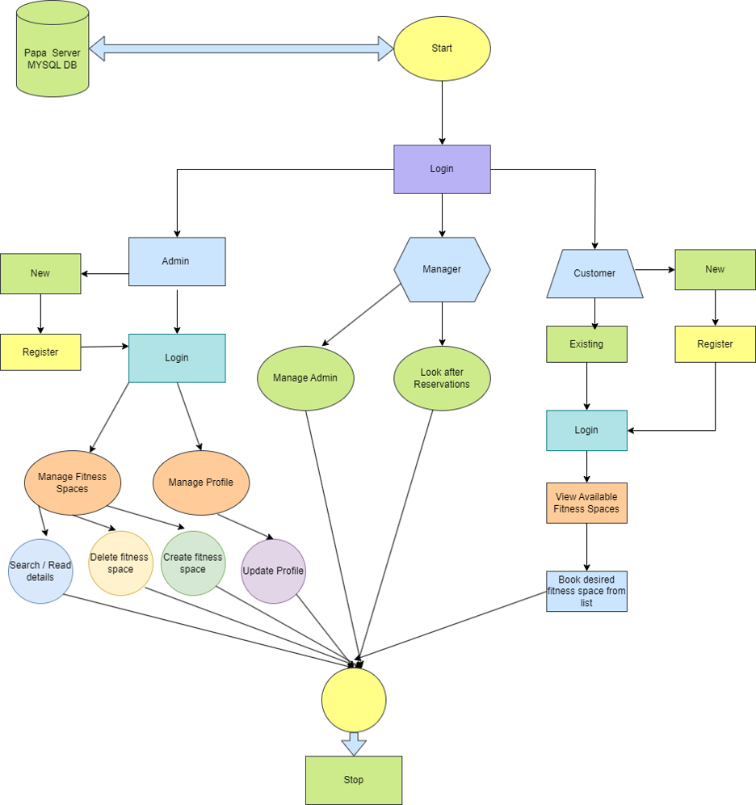
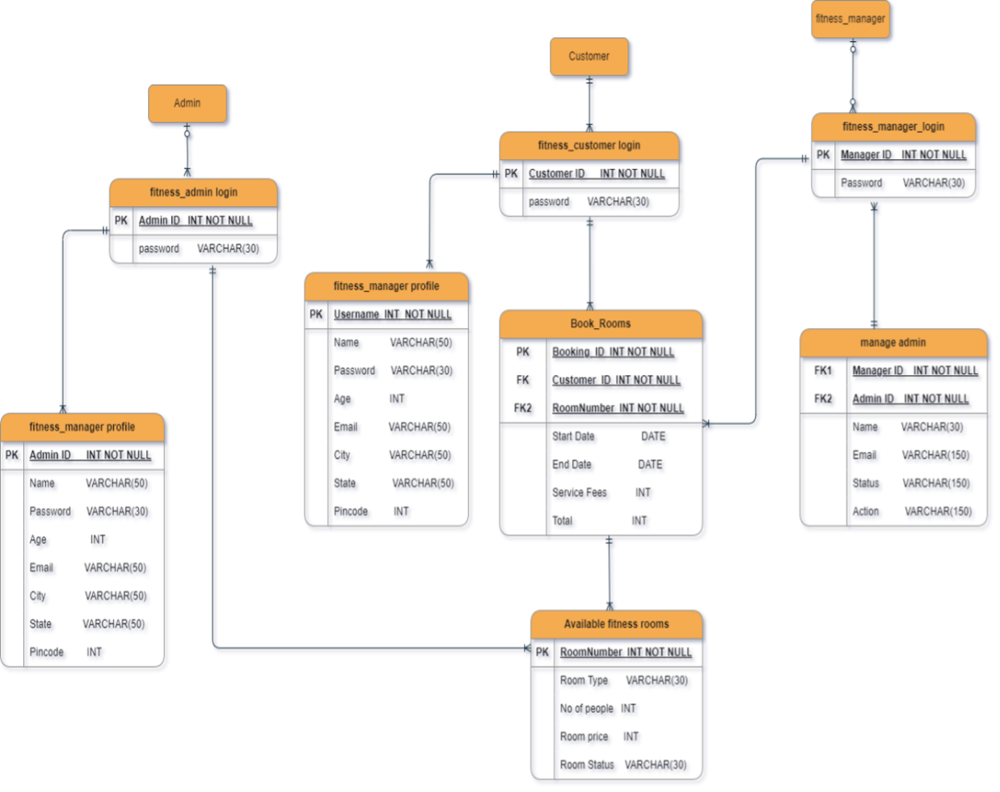

1. Introduction - Fitness Space Management System (FSMS) is a comprehensive Java-based application utilizing JavaFX, SQL, and the MVC framework to optimize the management of fitness spaces. With the escalating competition in the fitness industry, efficient and effective management is crucial for sustained growth and customer satisfaction. FSMS aims to provide an end-to-end solution facilitating seamless interactions for managers, administrators, and customers.
The system streamlines various operations such as membership tracking, equipment inventory management, scheduling, and user profiles. Employing MVC architecture, FSMS divides functionality into:
    - Model: Efficiently manages data and business logic using SQL to interact with the underlying database. It stores information related to memberships, schedules, and equipment inventory.
    - View: Offers an intuitive JavaFX interface for interactive user experiences. Managers can oversee operations, administrators have access to administrative tools, and customers can book sessions, view schedules, and manage memberships.
    - Controller: Orchestrates interactions between the model and view layers, ensuring seamless functionality and data integrity in response to user actions.

FSMS caters to different user services:
    1. Managers: Access comprehensive reports, manage staff schedules, and monitor facility performance through detailed analytics and resource allocation tools.
    2. Administrators: Control user access, system configurations, and database management, ensuring smooth operations and generating managerial reports.
    3. Customers: Enjoy a user-friendly interface to view schedules, book sessions, manage memberships, and receive notifications, fostering personalized experiences based on preferences and fitness goals.
    The system's interactive features facilitate seamless communication between users and the fitness space, enhancing overall user experience while optimizing management efficiency. FSMS serves as a comprehensive solution for effective fitness space administration, emphasizing user engagement and streamlined functionalities.

2.	Technologies Employed:

Technical Prerequisites:
Essential technologies encompassing Java, JavaFX, and MySQL databases were imperative for the development of this project, ensuring robust functionality and seamless interactions.
Front End Development:
Java FX - Utilizing JavaFX, an advanced software platform, to craft and deploy desktop applications, ensuring an engaging and user-friendly interface.
Back End Infrastructure:
Leveraging MySQL Developer, an integrated development environment specifically tailored for working with SQL in MySQL databases, to power the system's backend operations efficiently.
Domain Expertise:
The project necessitated adeptness in Fitness Space Management Systems, ensuring a comprehensive understanding of the domain's intricacies for effective system development.
Development Tools Employed:
Utilization of Java Eclipse and MYSQL Developer as primary tools to facilitate the development process, aiding in coding, debugging, and database management tasks seamlessly.

3.	Application Design

4.	Database
The Fitness Space Management System (FSMS) operates on a robust database structure comprising five key tables: `fitness_admins`, `fitness_customers`, `fitness_managers`, `fitness_rooms`, and `fitness_bookings`. These tables form the backbone of the system, storing essential data and facilitating seamless interactions between various system components.
    1. `fitness_admins`: This table stores information related to administrators, including their credentials, access rights, and system-related configurations. It enables secure access and management for administrative users.
    2. `fitness_customers`: This table maintains data concerning customers utilizing the system. It includes customer profiles, membership details, preferences, and booking histories, ensuring personalized experiences and effective customer management.
    3. `fitness_managers`: Stores details about managers overseeing the fitness spaces. Information such as managerial roles, schedules, and responsibilities is managed within this table, allowing efficient management of operational aspects.
    4. `fitness_rooms`: This table is responsible for managing information related to available rooms or spaces within the fitness facility. It includes fitness space details, availability status, and other relevant data for fitness space customer bookings.
    5. `fitness_bookings`: Tracks all booking-related information, including customer bookings, reserved spaces, session schedules, and booking statuses. It serves as a pivotal component for managing customer interactions and ensuring efficient resource allocation.

The utilization of these five interconnected tables ensures a structured and organized approach to data management within the FSMS. Through these tables, the system effectively handles user information, administrative controls, facility resources, and customer interactions, contributing to a seamless and optimized fitness space management experience.

